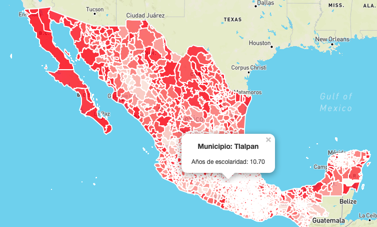

# Education in Mexico

The purpose of this task is to visualize the average years of education in Mexico for each municipality in a choropleth map. The data used for the construction of the map corresponds to 2010, that was the last census of population and housing study in Mexico. This study is done every 10 years, so, the results for 2020 will be released soon.

## Features

* Use of geopandas
* Use of Leaflet.js

## Built with 

* Leaflet.js
* Python

## Outcomes

